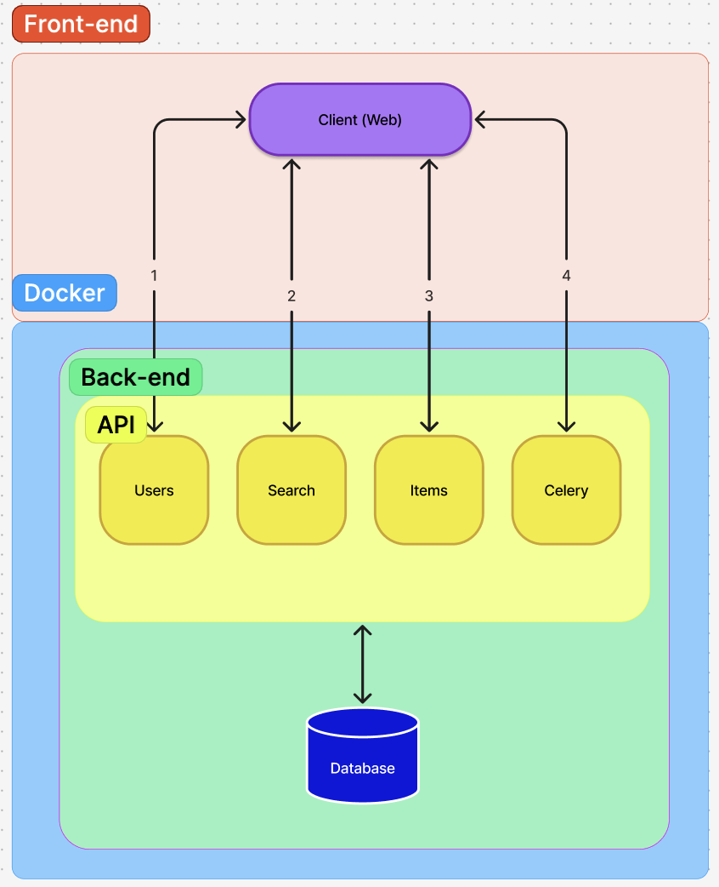
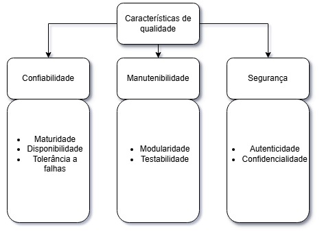

# Fase 1

## 1. Requisitante e partes interessadas

### 1.1. Requisitante:

- **Comunidade acadêmica da Universidade de Brasília (UnB)**: com destaque para os estudantes, uma vez que o sistema foi desenvolvido para atender à necessidade de centralizar e facilitar o processo de registro e recuperação de objetos perdidos dentro da universidade

### 1.2. Partes interessadas:

- **Estudantes da UnB:** são os principais usuários, pois utilizam o sistema para registrar itens perdidos ou encontrados.
- **Pessoas que encontram itens perdidos:** interagem com a plataforma para devolver objetos.
- **Equipe mantenedora/desenvolvedores:** responsáveis pela evolução do sistema, correções e manutenção.
- **Administração ou setores de apoio da universidade:** podem se beneficiar de um canal mais organizado para achados e perdidos.

---

## 2. Descrição estruturada do software selecionado

O **AcheiUnB** é uma aplicação web de código aberto voltada ao gerenciamento de achados e perdidos da UnB. O projeto permite registrar e localizar objetos, facilitando o contato entre quem perdeu e quem encontrou o item.

Sua escolha como objeto de avaliação se deve aos seguintes fatores:

- **Impacto no contexto acadêmico**: O sistema foi desenvolvido para atender uma necessidade real da comunidade universitária da UnB, centralizando o processo de registro e recuperação de objetos perdidos, reduzindo a dependência de grupos informais de mensagens e melhorando a organização desse tipo de comunicação.
- **Arquitetura moderna e projeto open source**: O AcheiUnB utiliza tecnologias amplamente empregadas no desenvolvimento web moderno, como Vue.js, Django e Docker, além de possuir código aberto e documentação pública no GitHub.
- **Integração entre múltiplos componentes**: O sistema possui separação entre frontend e backend, autenticação integrada e serviços containerizados, permitindo avaliar diferentes aspectos de qualidade de software em um contexto realista de aplicações web modernas.

Do ponto de vista técnico, o AcheiUnB utiliza uma arquitetura cliente-servidor com separação entre frontend e backend. O frontend web, desenvolvido em Vue.js, realiza a comunicação com uma API implementada em Python/Django, responsável pelos módulos de usuários, busca e gerenciamento de itens. O sistema também utiliza Docker para containerização dos serviços e possui integração com banco de dados e autenticação baseada em Microsoft MSAL. Além dos módulos principais, o sistema utiliza o Celery para execução de tarefas assíncronas, permitindo melhor gerenciamento de processos em segundo plano.

<section align="center" flex="col" style="margin-top: 5rem">
  
Imagem 1: Arquitetura do Projeto 

  
</section>

---

## 3. Classificação do tipo de produto

O AcheiUnB pode ser classificado como um software web de código aberto, de natureza cliente-servidor, com domínio específico voltado a achados e perdidos. Ele é distribuído sob licença MIT e foi implementado com tecnologias típicas de sistemas web modernos, o que reforça seu caráter de produto digital orientado a serviços online.

---

## 4. Propósito da avaliação

O propósito é avaliar a qualidade do AcheiUnB com ênfase nas características de **segurança**, **manutenibilidade** e **confiabilidade**. Ademais, pode-se também verificar se a plataforma cumpre bem seu papel de centralizar o registro e a recuperação de itens perdidos na UnB, oferecendo uma experiência funcional, organizada e adequada ao uso pela comunidade acadêmica.

Além disso, caso haja continuidade do projeto, a análise feita pode ser utilizada para futuras correções de inconsistências ou erros do projeto. Logo, o relatório e o repositório da análise da característica de Qualidade escrito pela equipe pode servir como contribuição direta para o projeto.

---

## 5. Modelo de qualidade e descrição

Como dito anteriormente, o AcheiUnB é uma plataforma de achados e perdidos voltada para a comunidade acadêmica da UnB. Seus principais stakeholders são estudantes que perderam ou encontraram objetos no campus, e a equipe de desenvolvimento responsável pela manutenção contínua do sistema.

A partir desse contexto, três características da norma ISO/IEC 25010 foram priorizadas: **Confiabilidade**, **Manutenibilidade** e **Segurança**.
A escolha dessas três características acima de outras na norma se dá por dois critérios principais: risco e impacto para os stakeholders.

- **Confiabilidade** foi priorizada porque falhas operacionais comprometem diretamente a função central da plataforma: conectar quem perdeu a quem encontrou um item.
- **Manutenibilidade** foi escolhida por se tratar de um projeto acadêmico com equipe rotativa, em que a facilidade de evolução e entrega contínua é crítica.
- **Segurança** foi incluída porque o sistema lida com dados de identidade institucional e restringe o acesso à comunidade da UnB, tornando a autenticação e a proteção de credenciais de extrema importância.

De acordo com as características escolhidas separamos suas subcaracterísticas no modelo de qualidade que serão avaliadas durante as fases e que tem relação entre elas.

### **Subcaracterísticas de Confiabilidade**
- Maturidade: O repositório mostra que o sistema é estável através do histórico do pipeline de testes no CI/CD. Além disso, a cobertura de código medida pelo Codecov ajuda a confirmar que o que foi desenvolvido está bem validado.
- Disponibilidade: Para garantir que o sistema continue rodando sem interrupções, o projeto utiliza a containerização com Docker Compose. Isso facilita a gestão dos serviços e ajuda a manter tudo operacional de forma mais consistente.
- Tolerância a Falhas: Foi observado que o sistema consegue continuar funcionando mesmo se houver alguma falha parcial. O uso do Celery é o que garante essa capacidade, permitindo que tarefas pesadas ou processos secundários não derrubem a aplicação principal.
- Recuperabilidade: Em caso de queda ou interrupção, o sistema está preparado para não perder dados. O uso do PostgreSQL como banco relacional garante a integridade das transações, permitindo que as informações sejam recuperadas corretamente após uma falha.

### **Subcaracterísticas de Manutenibilidade**
- Modularidade: O projeto apresenta uma separação clara entre as camadas da aplicação. Isso é visível na organização dos diretórios, que dividem bem o que é API, o que é parte Web e o que é Documentação.
- Reusabilidade: Foi observado que o sistema aproveita componentes em diferentes partes. Um exemplo disso é o uso do Django ORM, que é compartilhado tanto na API quanto nos módulos de usuários e itens, evitando retrabalho.
- Analisabilidade: O repositório facilita a identificação de falhas e pontos de melhoria. Ele utiliza o CodeCov integrado ao GitHub Actions para gerar relatórios de cobertura, o que ajuda a entender onde o código precisa de mais atenção.
- Modificabilidade: A estrutura permite fazer alterações sem quebrar o sistema facilmente. Isso é garantido pelo uso do Docker Compose, que isola as dependências de cada serviço, e pelo pipeline do GitHub Actions, que valida automaticamente cada mudança enviada.
- Testabilidade: O projeto está preparado para ser testado de forma eficiente. Ele já conta com testes automatizados configurados via pytest.ini, que rodam direto no pipeline de integração contínua toda vez que algo novo é submetido.
  
### **Subcaracterísticas de Segurança**
- Confidencialidade: O projeto protege informações sensíveis isolando credenciais (como Client ID e Secret) do código-fonte. Isso é feito através do uso de arquivos .env, garantindo que esses dados só sejam acessados por quem realmente tem permissão.
- Integridade: Para evitar que os dados sejam mexidos por quem não deve, o sistema usa o Django ORM. Ele faz todo o meio de campo com o banco de dados PostgreSQL de um jeito controlado, o que ajuda a manter as informações protegidas contra alterações indevidas.
- Ausência de Repúdio: O sistema mantém um histórico rastreável de tudo o que é feito. Isso é possível graças ao pipeline de CI/CD do GitHub Actions, que registra as execuções e alterações submetidas ao repositório.
- Rastreabilidade de Uso: O repositório consegue vincular as ações a usuários específicos. Essa identificação é feita pelo mecanismo de autenticação da Microsoft (MSAL), que associa cada sessão a uma identidade única da comunidade acadêmica da UnB.
- Autenticidade: A plataforma valida se o usuário realmente pertence à instituição. Como o login é vinculado ao sistema da Universidade de Brasília via MSAL, o acesso fica restrito apenas a quem faz parte da comunidade acadêmica.

<section align="center" flex="col" style="margin-top: 5rem">
  
Imagem 2: Modelo de qualidade

  
</section>

---

## 6. Escopo, profundidade e objetos de avaliação

### 6.1. Escopo da avaliação

A avaliação do AcheiUnB será realizada com foco nas características de **Confiabilidade**, **Manutenibilidade** e **Segurança**, conforme definidas no modelo de qualidade adaptado. Considerando que o sistema não está acessível para execução no momento da avaliação, o escopo será direcionado à análise documental e estática dos artefatos disponíveis no repositório.

Dessa forma, serão considerados como parte do escopo:

- Estrutura geral do repositório;
- Separação entre frontend, backend e documentação;
- Arquivos de configuração do ambiente;
- Evidências de autenticação e proteção de credenciais;
- Existência de testes automatizados e configuração de pipeline;
- Organização dos módulos e dependências;
- Evidências técnicas disponíveis na documentação e no código-fonte.

**Não** serão avaliados neste ciclo:

- Testes funcionais executados em ambiente real;
- Testes de carga ou desempenho;
- Validação com usuários finais;
- Auditoria completa de segurança;
- Avaliação de usabilidade, pois essa característica não pode ser escolhida nesta atividade;
- Disponibilidade real do sistema em produção.

### 6.2. Profundidade da avaliação

A profundidade da avaliação será limitada à análise dos artefatos disponíveis publicamente no repositório do projeto. Portanto, os resultados obtidos não devem ser interpretados como uma avaliação completa do comportamento do sistema em execução, mas sim como uma análise da qualidade observável a partir de sua documentação, código-fonte, configurações e estrutura técnica.

Essa abordagem permite verificar indícios de qualidade relacionados à **manutenção**, **segurança** e **confiabilidade**, mesmo sem acesso à aplicação em funcionamento. Dessa forma, a avaliação mantém coerência com a situação atual do sistema e evita prometer medições que dependam da execução da aplicação.

### 6.3. Objetos de avaliação

| Objeto de avaliação                              | Relação com a qualidade                                                   | Característica associada                  |
| ------------------------------------------------ | ------------------------------------------------------------------------- | ----------------------------------------- |
| Estrutura de diretórios `/API`, `/web` e `/docs` | Permite verificar separação de responsabilidades e organização do projeto | **Manutenibilidade**                      |
| Arquivos de configuração e Docker                | Permitem analisar a organização do ambiente e dos serviços                | **Manutenibilidade** / **Confiabilidade** |
| Configuração de testes e pipeline CI/CD          | Indica suporte à verificação automatizada do sistema                      | **Confiabilidade**                        |
| Autenticação via Microsoft MSAL                  | Evidencia mecanismo de controle de identidade                             | **Segurança**                             |
| Uso de variáveis de ambiente                     | Indica proteção de credenciais e dados sensíveis                          | **Segurança**                             |
| Organização dos módulos de backend e frontend    | Permite observar modularidade e separação de camadas                      | **Manutenibilidade**                      |
| Documentação do projeto                          | Apoia compreensão, manutenção e evolução do sistema                       | **Manutenibilidade**                      |
| Uso do Celery                                    | Indica suporte a tarefas assíncronas e processos em segundo plano         | **Confiabilidade**                        |

### 6.4. Limitações da avaliação

A principal limitação desta avaliação é a impossibilidade de acessar o sistema em execução. Por esse motivo, não será possível validar diretamente o comportamento real da aplicação, como login, cadastro de itens, busca, recuperação de objetos ou execução de fluxos completos pelo usuário.

Assim, a avaliação terá caráter documental e estático, com foco na análise dos artefatos disponíveis. Essa limitação será considerada nas fases seguintes, especialmente na definição das métricas e na interpretação dos resultados.

---

## 7. ODS e sua relação com o software

Aqui estão as ODS que tem relevância direta com o projeto do AcheiUnB e suas devidas explicações.

- **ODS 4 — Educação de Qualidade:**
  O meta associada é a **4.a**, que trata da oferta de infraestrutura e ambientes de aprendizagem seguros, inclusivos e eficazes para todos. A plataforma contribui para esse objetivo ao oferecer à comunidade acadêmica da UnB um canal institucional para registro e recuperação de objetos perdidos, reduzindo o impacto da perda de materiais acadêmicos como livros, documentos e equipamentos sobre a rotina dos estudantes. Ao substituir grupos informais de mensagens por um sistema estruturado e acessível, o AcheiUnB apoia a continuidade das atividades de estudo de forma organizada e adequada ao contexto universitário.

- **ODS 9 — Indústria, Inovação e Infraestrutura:**
  A meta associada é a **9.1**, que trata do desenvolvimento de infraestrutura de qualidade, confiável, sustentável e resiliente para apoiar o desenvolvimento econômico e o bem-estar humano. O AcheiUnB atua como um site que facilita a gestão de itens perdidos na universidade. Ao substituir outros métodos descentralizados como os murais físicos ou grupos de mensagens do Telegram e Whatsapp. A plataforma traz inovação para o cotidiano acadêmico, oferecendo um serviço digital seguro e estruturado que melhora diretamente a infraestrutura de apoio aos estudantes e servidores.

- **ODS 11 — Cidades e Comunidades Sustentáveis:**
  A meta associada é a **11.3**, que visa aumentar a urbanização inclusiva e as capacidades para o planejamento e gestão participativa e integrada dos assentamentos humanos. O AcheiUnB promove um ambiente mais organizado e solidário, integrando a comunidade ao facilitar a honestidade e cooperação dos estudantes, resultando em uma convivência mais colaborativa e melhorando a qualidade dos serviços de utilidade pública.

- **ODS 12 — Consumo e Produção Responsáveis:**
  A meta associada é a **12.5**, que estabelece a redução da geração de resíduos por meio da reutilização e recuperação de materiais. Ao facilitar a devolução de objetos perdidos aos seus donos, o AcheiUnB contribui diretamente para a redução do descarte desnecessário de itens que, sem um canal adequado, seriam abandonados ou extraviados permanentemente. Esse vínculo é especialmente relevante em um campus universitário, onde o volume de pessoas em trânsito diário torna a perda e o descarte de objetos um problema recorrente.

- **ODS 16 – Paz, justiça e instituições eficazes:**
  A meta associada é a **16.6**, que busca desenvolver instituições eficazes, responsáveis e transparentes em todos os níveis. O AcheiUnB contribui para esse objetivo ao criar um canal oficial, rastreável e organizado para a gestão de objetos perdidos no campus. A plataforma reduz a informalidade e a desorganização do serviço de Achados e Perdidos, garantindo um processo transparente que diminui a apropriação indevida de bens alheios. Dessa forma, o sistema apoia a universidade a atuar como uma instituição mais eficaz e responsável na garantia e no respeito à propriedade de seus alunos e funcionários.

---

## Bibliografia

- **AcheiUnB.** Repositório do Projeto Analisado: Contém o código e informações mais técnicas sobre o funcionamento da aplicação. Disponível em: <https://github.com/unb-mds/2024-2-AcheiUnB>. Acesso em: 14 mai. 2026.

- **ISO/IEC 25010:2023 — Systems and software engineering — Systems and software Quality Requirements and Evaluation (SQuaRE) — Product quality model.** International Organization for Standardization, 2023. Disponível em: [https://www.iso.org/obp/ui/en/#iso:std:iso-iec:25010:ed-2:v1:en](https://www.iso.org/obp/ui/en/#iso:std:iso-iec:25010:ed-2:v1:en).

- **ODS 4. Educação de qualidade.** — Instituto de Pesquisa Econômica Aplicada, 2019. Disponível em: [https://www.ipea.gov.br/ods/ods4.html](https://www.ipea.gov.br/ods/ods4.html).

- **ODS 9. Indústria, Inovação e Infraestrutura.** — Instituto de Pesquisa Econômica Aplicada, 2019. Disponível em: [https://www.ipea.gov.br/ods/ods9.html](https://www.ipea.gov.br/ods/ods9.html).

- **ODS 12. Consumo e Produção Sustentáveis** — Instituto de Pesquisa Econômica Aplicada, 2019. Disponível em: [https://www.ipea.gov.br/ods/ods12.html](https://www.ipea.gov.br/ods/ods12.html).

- **ODS 16. Paz, Justiça e Instituições Eficazes.** — Instituto de Pesquisa Econômica Aplicada, 2019. Disponível em: [https://www.ipea.gov.br/ods/ods16.html](https://www.ipea.gov.br/ods/ods16.html).

---

## Histórico de Versão

| Versão |    Data    | Descrição                                                                                  | Autor           |
| :----: | :--------: | ------------------------------------------------------------------------------------------ | --------------- |
|  1.0   | 12/05/2026 | Elaboração inicial das seções 1 ao 4                                                       | João Nascimento |
|  1.1   | 12/05/2026 | Elaboração do escopo, profundidade, objetivos de avaliação e Adição do histórico de versão | Euller          |
|  1.2   | 13/05/2026 | Elaboração do modelo de qualidade e descrição aprofundando                                 | Davi            |
|  1.3   | 13/05/2026 | Elaboração do tópico sobre ODS e relação com o software e adição de bibliografia           | Davi            |
|  1.4   | 14/05/2026 | Adição dos tópicos 9, 11 e 16 dos ODS e formatação/refatoração da documentação             | Diogo           |
|  1.3   | 13/05/2026 | Adição de novas subcaracterísticas ao tópico 5                                             | Davi            |
