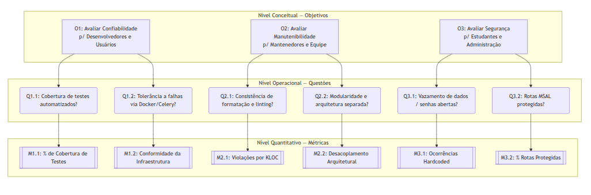

# Fase 2: Definição de Objetivos de Medição

## 1. Introdução

O objetivo desta fase é definir [objetivos de medição](#_1-objetivos-de-medição) e estabelecer métricas para avaliar a qualidade do [AcheiUnB](https://github.com/unb-mds/2024-2-AcheiUnB), utilizando a abordagem GQM, que conecta metas de alto nível a métricas de avaliação. Os objetivos serão fundamentados nas prioridades identificadas na [Fase 1](/fases/fase1#_5-modelo-de-qualidade-descri%c3%a7%c3%a3o-e-prioriza%c3%a7%c3%a3o), com foco em **Confiabilidade**, **Manutenibilidade** e **Segurança**, considerando os diversos pontos de vista (como desenvolvedores, comunidade acadêmica e administração) e o contexto de uso do sistema na Universidade de Brasília.

> Os objetivos acima fundamentam as questões de medição definidas na [Seção 3](#_3-questões-e-hipóteses-de-medição).

## 2. Objetivos de Medição

A definição dos objetivos de medição segue o template estruturado do paradigma GQM (Goal, Question, Metric), alinhando-se às três características de qualidade priorizadas na Fase 1 (**Confiabilidade**, **Manutenibilidade** e **Segurança**) e ao propósito de avaliação do sistema **AcheiUnB** por meio de análise estática e documental.

### Objetivo 1: Foco em Confiabilidade
| Elemento GQM | Descrição |
| :--- | :--- |
| **Analisar** | A estrutura técnica, configurações de ambiente (Docker/Celery) e a suíte de testes automatizados do AcheiUnB. |
| **Com o propósito de** | Avaliar e caracterizar a maturidade técnica e a resiliência operacional do sistema. |
| **Com relação a** | Confiabilidade (Maturidade, Disponibilidade, Tolerância a falhas, Recuperabilidade). |
| **Do ponto de vista de** | Desenvolvedores e Comunidade acadêmica da UnB (usuários). |
| **No contexto de** | Disciplina de Qualidade de Software, garantia de estabilidade e funcionamento contínuo do sistema de achados e perdidos da universidade. |

### Objetivo 2: Foco em Manutenibilidade
| Elemento GQM | Descrição |
| :--- | :--- |
| **Analisar** | O código-fonte, a estrutura de diretórios, a configuração de pipeline (CI/CD) e a documentação técnica do AcheiUnB. |
| **Com o propósito de** | Avaliar a facilidade de evolução, adaptação e manutenção do código por equipes rotativas em ambiente acadêmico. |
| **Com relação a** | Manutenibilidade (Modularidade, Reusabilidade, Analisabilidade, Modificabilidade, Testabilidade). |
| **Do ponto de vista de** | Equipe de desenvolvimento e futuros mantenedores do projeto open source. |
| **No contexto de** | Disciplina de Qualidade de Software, evolução contínua e facilidade de manutenção do sistema por equipes rotativas em ambiente acadêmico. |

### Objetivo 3: Foco em Segurança
| Elemento GQM | Descrição |
| :--- | :--- |
| **Analisar** | Os mecanismos de controle de acesso (autenticação MSAL), uso de variáveis de ambiente e restrições do banco de dados do AcheiUnB. |
| **Com o propósito de** | Avaliar o grau de proteção das informações e a adequação dos mecanismos de controle de acesso ao sistema. |
| **Com relação a** | Segurança (Confidencialidade, Integridade, Ausência de repúdio, Rastreabilidade de uso, Autenticidade). |
| **Do ponto de vista de** | Administração da universidade e estudantes (titulares dos dados). |
| **No contexto de** | Disciplina de Qualidade de Software, proteção de dados institucionais, identidade estudantil e restrição de acesso exclusivo à comunidade da UnB. |

> Os objetivos acima fundamentam as questões de medição definidas na [Seção 3](#_3-questões-e-hipóteses-de-medição).

## 3. Questões e Hipóteses de medição

As questões foram formuladas visando tornar os [objetivos de avaliação](#_2-objetivos-de-medição) em perguntas práticas que podem ser respondidas por meio da análise estática do repositório do [AcheiUnB](https://github.com/unb-mds/2024-2-AcheiUnB). As hipóteses representam as expectativas da equipe baseadas no entendimento prévio do *software*, guiando o processo de interpretação dos resultados.

### Confiabilidade

#### Questão 1.1 (Maturidade)
Qual é a abrangência da cobertura de testes automatizados no sistema?  
*([Referente às Partes Interessadas - Desenvolvedores e Usuários](/fases/fase1#_12-partes-interessadas))*

> **Hipótese 1.1:** Espera-se que a cobertura de testes da aplicação seja superior a 70%, indicando um esforço razoável da equipe de desenvolvimento em garantir estabilidade.

#### Questão 1.2 (Tolerância a Falhas/Disponibilidade)
O sistema utiliza e documenta adequadamente ferramentas de conteinerização (Docker) e geradores de tarefas assíncronas (Celery) para garantir a manutenção contínua da operação?  
*([Referente às Partes Interessadas - Desenvolvedores e Usuários](/fases/fase1#_12-partes-interessadas))*

> **Hipótese 1.2:** Acredita-se que o repositório possua configurações completas e funcionais do Docker Compose e Celery, fundamentais para a tolerância a falhas na arquitetura proposta.

### Manutenibilidade

#### Questão 2.1 (Analisabilidade)
O projeto adota ferramentas e regras consistentes de formatação (*linting*) e padronização de código?  
*([Referente às Partes Interessadas - Desenvolvedores e Mantenedores](/fases/fase1#_12-partes-interessadas))*

> **Hipótese 2.1:** Espera-se encontrar um baixo índice de violações de estilo (*linting*), evidenciando alta adesão à padronização e boas práticas.

#### Questão 2.2 (Modularidade)
A arquitetura e a separação entre as camadas (Frontend, Backend, Documentação) são claras e padronizadas no repositório?  
*([Referente às Partes Interessadas - Desenvolvedores e Mantenedores](/fases/fase1#_12-partes-interessadas))*

> **Hipótese 2.2:** Estima-se um isolamento físico quase total dos diretórios de Frontend e Backend, existindo baixo acoplamento interno no repositório.

### Segurança

#### Questão 3.1 (Confidencialidade)
O código-fonte está protegido contra o vazamento de dados sensíveis e credenciais expostas diretamente (*hardcoded*)?  
*([Referente às Partes Interessadas - Administração e Usuários](/fases/fase1#_12-partes-interessadas))*

> **Hipótese 3.1:** Acredita-se que 100% das credenciais de bancos de dados e APIs externas estejam externalizadas em variáveis de ambiente (`.env`).

#### Questão 3.2 (Autenticidade)
O mecanismo de autenticação via MSAL restringe adequadamente o acesso aos *endpoints* essenciais e manipuladores de dados da API?  
*([Referente às Partes Interessadas - Administração e Usuários](/fases/fase1#_12-partes-interessadas))*

> **Hipótese 3.2:** Espera-se que todas as rotas que realizam manipulação de dados sensíveis e transações exijam validação através de *tokens* de autenticação válidos.

> Cada questão formulada acima é respondida por uma métrica específica, conforme detalhado na [Seção 4](#_4-seleção-de-métricas).

## 4. Seleção de Métricas

As métricas selecionadas visam ser objetivas e quantificáveis através de ferramentas de análise estática e inspeção visual do código.

| ID | Métrica | Descrição e Forma de Coleta | Relacionamento |
| :--- | :--- | :--- | :--- |
| **M1.1** | Porcentagem de Cobertura de Testes | Percentual extraído das ferramentas de relatório de cobertura de código (ex: `pytest-cov`, Codecov). | Responde [Q1.1](#questão-11-maturidade) |
| **M1.2** | Índice de Conformidade da Infraestrutura | Avaliação baseada em checklist da presença e configuração dos arquivos de Docker e Celery. | Responde [Q1.2](#questão-12-tolerância-a-falhasdisponibilidade) |
| **M2.1** | Densidade de Violações de Estilo | Quantidade de avisos/erros reportados por ferramentas de *linting* (ex: ESLint, Flake8) normalizados a cada 1000 linhas de código (Defeitos por KLOC). | Responde [Q2.1](#questão-21-analisabilidade) |
| **M2.2** | Grau de Desacoplamento Arquitetural | Checklist de segregação de responsabilidades do repositório (diretórios, pacotes e dependências de frontend/backend). | Responde [Q2.2](#questão-22-modularidade) |
| **M3.1** | Taxa de Credenciais *Hardcoded* | Contagem de instâncias onde senhas, chaves secretas ou conexões DB estejam abertas no código. | Responde [Q3.1](#questão-31-confidencialidade) |
| **M3.2** | Percentual de Rotas Protegidas | Razão entre a quantidade de *endpoints* sensíveis na API que exigem autenticação (*middlewares*) e a quantidade total de *endpoints* sensíveis desenvolvidos. | Responde [Q3.2](#questão-32-autenticidade) |

As métricas selecionadas atendem às seguintes propriedades desejáveis: **Simplicidade** — podem ser coletadas com ferramentas padrão de mercado (`pytest-cov`, ESLint, Flake8, Codecov) sem configuração especial; **Objetividade** — produzem valores numéricos ou categóricos sem margem de ambiguidade na interpretação; **Validade** — estão fundamentadas na literatura de Engenharia de Software (BASILI et al., 2003; SOLLAMI; AL-ZUBAIDI, 2019) e em práticas consolidadas de avaliação estática de qualidade.

> Os critérios de julgamento para interpretação dos valores coletados estão definidos na [Seção 5](#_5-níveis-de-pontuação-e-critérios-de-julgamento).

## 5. Níveis de Pontuação e Critérios de Julgamento

Para remover a subjetividade, cada métrica receberá uma nota baseada em uma escala de 1 a 4, onde 1 representa a pior classificação e 4 representa a excelência, conforme os limiares abaixo:

### 5.1 Níveis de Pontuação

| Métrica | Nível 1 (Insuficiente) | Nível 2 (Satisfatório) | Nível 3 (Bom) | Nível 4 (Excelente) |
| :--- | :--- | :--- | :--- | :--- |
| **M1.1** (Cobertura de Testes) | < 40% | De 40% a 59% | De 60% a 79% | ≥ 80% |
| **M1.2** (Checklist de Infraestrutura) | < 50% dos itens | De 50% a 74% dos itens | De 75% a 99% dos itens | 100% dos itens adequados |
| **M2.1** (Densidade de *Linting*) | > 30 erros / KLOC | De 16 a 30 erros / KLOC | De 6 a 15 erros / KLOC | ≤ 5 erros / KLOC |
| **M2.2** (Desacoplamento Arquitetural) | Sem separação (Código fortemente acoplado) | Separação parcial (Muitas dependências cruzadas) | Separação majoritária (Poucos acoplamentos incorretos) | Separação Total (Backend servindo apenas API) |
| **M3.1** (Ocorrências *Hardcoded*) | 1 ou mais no código fonte ou rotas de produção | 1 a 2 ocorrências exclusivas em *logs* ou *prints* | 1 a 2 ocorrências apenas em testes/mocks locais | Nenhuma ocorrência em todo o projeto |
| **M3.2** (Rotas Sensíveis Protegidas) | < 70% | De 70% a 89% | De 90% a 99% | 100% |

### 5.2 Critérios de Julgamento Geral

Os resultados obtidos definirão o **Índice de Qualidade (IQ)** de cada Característica e, finalmente, o Índice Global.
Como não utilizaremos ponderação entre as métricas, todas possuem peso 1.

*   **IQ da Característica:** Média aritmética simples das notas das métricas atreladas àquela característica. (ex: IQ Confiabilidade = (M1.1 + M1.2) / 2)
*   **Índice de Qualidade Global (IQG):** Média aritmética simples dos IQs das 3 características (Confiabilidade, Manutenibilidade, Segurança).

O valor final do IQG será mapeado no seguinte julgamento de qualidade para entrega ao usuário final:
*   **1,00 a 1,75:** Inaceitável (Rejeição imediata)
*   **1,76 a 2,50:** Aceito com ressalvas críticas (Requer grande reestruturação)
*   **2,51 a 3,25:** Aceito (Qualidade de mercado, pequenos ajustes recomendados)
*   **3,26 a 4,00:** Excelente (Nível exemplar de maturidade de engenharia)

## 6. Representação da Hierarquia GQM (Gráfico GQM)

A **Figura 4** apresenta a representação visual da hierarquia GQM (Goal-Question-Metric) adotada neste plano de medição. O diagrama ilustra como os [Objetivos de Medição](#_2-objetivos-de-medição) de alto nível (**Confiabilidade**, **Manutenibilidade** e **Segurança**) são decompostos em [Questões](#_3-questões-e-hipóteses-de-medição) específicas para avaliação. Por sua vez, cada Questão é conectada às [Métricas](#_4-seleção-de-métricas) quantitativas que fornecerão os dados necessários para respondê-las. A estrutura evidencia os três níveis lógicos da abordagem GQM, sendo eles o Conceitual (Objetivos), Operacional (Questões e Hipóteses) e Quantitativo (Métricas).

**Figura 4:** Diagrama hierárquico GQM.

**Fonte:** Elaborado pelo autor [Euller Júlio](https://github.com/potatoyz908) (2026).

## 7. Consistência entre Fase 1 e Fase 2

A formulação das questões e métricas nesta fase respeita rigorosamente o **Escopo da Avaliação** definido na [Fase 1](/fases/fase1#_61-escopo-da-avalia%c3%a7%c3%a3o). Como a Fase 1 concluiu de forma explícita que o sistema não está acessível em produção (impedindo medições ativas como Testes de Desempenho e de Carga), a Fase 2 definiu intencionalmente **Métricas Estáticas e de Inspeção Documental**.

Os objetivos GQM (Nível Conceitual) refletem diretamente:
1.  **As características priorizadas:** Confiabilidade, Manutenibilidade e Segurança foram preservadas como o núcleo dos focos de medição (ver [Modelo de Qualidade, Fase 1](/fases/fase1#_5-modelo-de-qualidade-descri%c3%a7%c3%a3o-e-prioriza%c3%a7%c3%a3o)).
2.  **Os *stakeholders* elencados:** As visões dos desenvolvedores (focados em código e infraestrutura) e da administração/estudantes (preocupados com segurança de dados) conduziram a seleção das questões de qualidade do *software* (ver [Partes Interessadas, Fase 1](/fases/fase1#_12-partes-interessadas)).

O alinhamento garante a rastreabilidade total do projeto e fundamenta o plano metodológico adotado para o processo avaliativo do AcheiUnB.

## 8. Uso de Inteligência Artificial

Em conformidade com a exigência e a ética da disciplina de Qualidade de Software, certificamos que a Inteligência Artificial (Modelo LLM *Antigravity/Gemini*) foi utilizada no papel de **Assistente de Redação**, corrigindo erros gramaticais e de formatação.

A formulação crítica dos critérios de julgamento, dos pesos, dos limites quantitativos para as escalas e o alinhamento arquitetural do projeto AcheiUnB foram pensados, refinados e revisados inteiramente por intervenção humana dos membros da equipe. Todo o conteúdo gerado pela IA foi submetido à leitura crítica individual por cada autor, com ajuste dos limites quantitativos, seleção das subcaracterísticas e alinhamento ao contexto específico do AcheiUnB realizados exclusivamente pelos integrantes do grupo. Nenhuma figura inadequada, ícone excessivo ou conclusão de dados foi gerada artificialmente.

---

## Bibliografia

- **ACHEIUNB.** Repositório do Projeto Analisado. Disponível em: <https://github.com/unb-mds/2024-2-AcheiUnB>. Acesso em: 10 jun. 2026.

- **ISO/IEC.** ISO/IEC 25010:2011 — Systems and software engineering — Systems and software Quality Requirements and Evaluation (SQuaRE) — System and software quality models. International Organization for Standardization, 2011.

- **MARTINEZ, L. et al.** Assistant for the Evaluation of Software Product Quality Characteristics Proposed by ISO/IEC 25010 Based on GQM-Defined Metrics. *SEDICI*, 2018. Disponível em: <https://sedici.unlp.edu.ar>.

- **BASILI, V. R. et al.** The Goal/Question/Metric Paradigm. *Fraunhofer IESE*, 2003.

- **SOLLAMI, T.; AL-ZUBAIDI, L.** Software Quality Metrics and Evaluation Using GQM Approach. *International Journal of Computer Applications*, 2019.

---

## Histórico de Versão

| Versão |    Data    | Descrição                                                                                  | Autor           |
| :----: | :--------: | ------------------------------------------------------------------------------------------ | --------------- |
|  1.0   | 10/06/2026 | Criação da estrutura base do documento Fase 2                                              | [Euller Júlio](https://github.com/potatoyz908)         |
|  1.1   | 10/06/2026 | Implementação dos Objetivos de Medição (Nível Conceitual) seguindo o template estruturado GQM | [Euller Júlio](https://github.com/potatoyz908)          |
|  1.2   | 10/06/2026 | Implementação final das seções 2 até 4, da Fase 2 (Questões, Hipóteses, Métricas e Níveis de Pontuação e Critérios de Julgamento) | [Euller Júlio](https://github.com/potatoyz908) |
|  1.3   | 11/06/2026 | Implementação final das seções 5 até 8, da Fase 2 (representação da hierarquia GQM, consistência entre fases, declaração de uso de IA e referências) | [Euller Júlio](https://github.com/potatoyz908) |
|  1.3   | 11/06/2026 | Adição da Introdução, unificação de Questões e Hipóteses e inclusão de hiperlinks de rastreabilidade | [Euller Júlio](https://github.com/potatoyz908) |
|  1.4   | 11/06/2026 | Expansão dos objetivos GQM, adição de referências bibliográficas, melhoria da declaração de uso de IA e correções de formatação | [Euller Júlio](https://github.com/potatoyz908) |
|  1.5   | 11/06/2026 | Correções de digitação e enumeração                              | [Euller Júlio](https://github.com/potatoyz908) |
