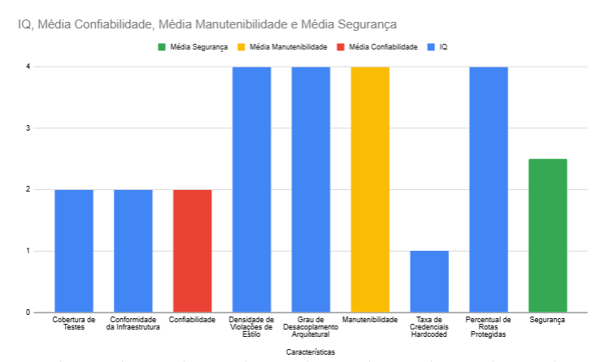

# Fase 4: Execução, Análise e Julgamento

## 1. Introdução

Nessa última fase do processo de avaliação do produto [AcheiUnB](https://github.com/unb-mds/2024-2-AcheiUnB), serão descritas a obtenção dos dados e a apresentação dos [artefatos](/fases/fase3?id=_22-procedimento-por-m%c3%a9trica) citados de acordo com a Fase 3, além da conversão desses dados em métricas para comparação com os [níveis de pontuação definidos](/fases/fase2?id=_5-n%c3%adveis-de-pontua%c3%a7%c3%a3o-e-crit%c3%a9rios-de-julgamento) na Fase 2 e da resposta aos [objetivos](/fases/fase2?id=_2-objetivos-de-medi%c3%a7%c3%a3o) e às [questões](/fases/fase2?id=_3-quest%c3%b5es-e-hip%c3%b3teses-de-medi%c3%a7%c3%a3o) introduzidas pelo método GQM. Ao final, será justificada a coerência dos resultados com o [propósito](/fases/fase1?id=_4-prop%c3%b3sito-da-avalia%c3%a7%c3%a3o) postulado na Fase 1, bem como discutido o julgamento final da equipe e exibidas as ações concretas de melhoria que a equipe de desenvolvimento poderá realizar.

<br>

## 2. Execução (Obtenção das Medidas)

A execução da avaliação foi realizada sobre o *snapshot* congelado do repositório do AcheiUnB, registrado no **commit de referência** (`e91773380c5259007d748d85e998a27362537339`) definido pela equipe. Todas as medições seguiram o método de **análise estática e inspeção documental** estabelecido na Fase 3, com registro dos artefatos brutos em pastas específicas dentro de `dados-brutos`, de forma a garantir reprodutibilidade, rastreabilidade e auditoria dos resultados. 

Para a **M1.1 (Cobertura de Testes)**, foi executado `cd API && coverage run -m pytest && coverage report -m && coverage xml -o ../coverage.xml`, a partir do backend do projeto, para obter o relatório consolidado de cobertura. Como evidências, foram armazenados o XML e o relatório textual do codecov com o valor final da cobertura.

Para a **M1.2 (Conformidade da Infraestrutura)**, a equipe inspecionou os arquivos de containerização e orquestração do backend, incluindo `Dockerfile`, `docker-compose.yml`, `docker-compose.prod.yml` e a integração com Celery. Também foram registrados os resultados da validação do `docker compose config`. Ademais, foi feita a realização da inspeção manual, via checklist da seção 2.3 da fase 3, a qual também recebeu evidências próprias que justificam a presença e ausência de cada item.

Para a **M2.1 (Densidade de Violações de Estilo)**, foram executadas as ferramentas `ruff`, `black`, `prettier` e `cloc` sobre o código-fonte do frontend e backend, com o objetivo de obter o número de violações de estilo e normalizá-lo por KLOC. Foram preservados os relatórios das ferramentas das execuções.

Para a **M2.2 (Grau de Desacoplamento Arquitetural)**, foram coletadas evidências da separação entre frontend e backend, da estrutura modular dos diretórios e da inexistência de dependências circulares no frontend por meio do `madge`. Por fim, houve a realização da inspeção manual, a qual também recebeu evidências próprias que justificam a presença e ausência de cada item.

Para a **M3.1 (Taxa de Credenciais Hardcoded)**, foi executado o `gitleaks` sobre o repositório, com posterior inspeção manual do resultado encontrado. A ocorrência registrada foi documentada com o arquivo bruto, captura de tela e análise contextual do arquivo afetado.

Para a **M3.2 (Percentual de Rotas Protegidas)**, foram inventariadas as rotas da API a partir dos arquivos `urls.py` e `views.py`, com apoio dos relatórios de `permission_classes`, `authentication_classes`, `IsAuthenticated` e `APIView`, registrando o conjunto de rotas consideradas sensíveis e sua proteção por autenticação/autorização.

---

<br>

## 3. Dados Brutos (Arquivos e Imagens)

Os artefatos brutos foram organizados por métrica, para facilitar a auditoria e a localização dos resultados. Eles se encontram em uma pasta dedicada na root do projeto e possui a seguinte estrutura adotada:

```text
dados-brutos/
├── M1_1_Cobertura_Testes/
│   ├── coverage_codecov.txt
│   └── coverage.xml
├── M1_2_Infraestrutura/
│   ├── ausencia_env.png
│   ├── celery_imports.txt
│   ├── django_celery_integracao.txt
│   ├── docker_compose_config.txt
│   ├── docker_compose_error.png
│   ├── docker_compose_prod.txt
│   ├── docker-compose.log
│   ├── dockerfile.txt
│   └── shared_tasks.txt
├── M2_1_Padroes_Codigo/
│   ├── black.txt
│   ├── cloc.json
│   ├── prettier.txt
│   └── ruff.json
├── M2_2_Arquitetura_Modularizacao/
│   ├── estrutura_backend.txt
│   ├── estrutura_frontend.txt
│   ├── madge.png
│   └── madge.txt
├── M3_1_Gestao_Segredos/
│   ├── gitleaks.json
│   └── gitleaks.png
└── M3_2_Protecao_Rotas/
    ├── api_view.txt
    ├── apiviews.txt
    ├── authentication_classes.txt
    ├── is_authenticated.txt
    └── permission_classes.txt
```

<br>

## 4. Análise e Respostas GQM (Métricas e Questões)

Os dados coletados foram transformados em métricas e comparados com os níveis de pontuação definidos na Fase 2, mantendo rastreabilidade com o plano de execução da Fase 3. Essa relação está disposta na **tabela 12**. A leitura dos resultados considera não apenas os valores numéricos, mas também o contexto arquitetural do AcheiUnB, a natureza das evidências obtidas e a relação entre cada métrica e a questão GQM correspondente.

---

### 4.1 Resultados por métrica

<div align="center">

**Tabela 1:** Resultados e rastreabilidade dos dados

| Métrica                                    |                                                 Resultado | Nota | Questão |
| ------------------------------------------ | --------------------------------------------------------: | ---: | ------- |
| M1.1 – Cobertura de Testes                 |                                                       43% |    2 | Q1.1    |
| M1.2 – Conformidade da Infraestrutura      |                               6/9 itens conformes (66,7%) |    2 | Q1.2    |
| M2.1 – Densidade de Violações de Estilo    |                                       2,14 violações/KLOC |    4 | Q2.1    |
| M2.2 – Grau de Desacoplamento Arquitetural |                                 0 dependências circulares |    4 | Q2.2    |
| M3.1 – Taxa de Credenciais Hardcoded       |                               Ocorrência de chave privada |    1 | Q3.1    |
| M3.2 – Percentual de Rotas Protegidas      |                                                      100% |    4 | Q3.2    |

**Fonte:** Elaborado por [João Nascimento](https://github.com/JMPNascimento) (2026).

</div>

---

### 4.2 Interpretação por questão

**Q1.1 – Cobertura de testes automatizados**

A cobertura global obtida foi de **43%**, o que confirma a existência de uma suíte de testes, mas ainda em patamar intermediário. O resultado não invalida a estratégia de teste adotada pelo projeto, porém mostra que a base de testes ainda não cobre o sistema de forma ampla o suficiente para sustentar alterações com alto grau de confiança. Em termos práticos, isso significa que o projeto possui validação automatizada, mas ainda não em nível robusto de proteção contra regressões. A cobertura declarada no `codecov.yml` superior a 90%, não se confirmou, o que faz a métrica responder à questão de forma apenas parcialmente satisfatória.

**Q1.2 – Infraestrutura e tolerância a falhas**

A infraestrutura do projeto apresenta uma base clara de containerização e execução: `Dockerfile`, `docker-compose.yml`, `docker-compose.prod.yml`, configuração de Celery e tarefas assíncronas já implementadas no backend. Ainda assim, o checklist consolidado fechou em **6 de 9 itens**, pois faltam evidências ou itens completos em pontos relevantes para reprodutibilidade e robustez operacional, como `healthchecks`, `.env.example` e a validação completa do `docker compose config -q` sem dependência de um arquivo `.env` ausente. Isso mostra que o sistema já tem uma infraestrutura estruturada, mas a completude operacional ainda não atinge o nível máximo. A hipótese de configuração “completa e funcional” não foi confirmada integralmente, embora a base de implantação esteja bem encaminhada.

**Q2.1 – Analisabilidade e padronização**

A análise estática mostrou que o `ruff` não encontrou violações e o `black` não apontou arquivos fora do padrão. O `prettier`, por sua vez, identificou 31 arquivos com ajustes de formatação, mas, quando a quantidade total de violações é normalizada pelo tamanho da base de código analisada, a densidade resultante é de 2,14 violações por KLOC. Esse valor é baixo e, pela escala definida, fica dentro do nível máximo de qualidade. Isso sugere que a padronização de código é forte e que os desvios de estilo encontrados no frontend não comprometem o quadro geral de analisabilidade do projeto. Em outras palavras, o sistema ainda possui pequenos pontos de formatação a corrigir, mas o volume de inconsistências é reduzido em relação ao tamanho total do código.

**Q2.2 – Modularidade e desacoplamento**

A análise do frontend com `madge` processou os arquivos `src` com sucesso e não encontrou dependências circulares. Em conjunto com a organização do repositório, isso evidencia uma separação clara entre backend e frontend. O backend está dividido em apps Django com responsabilidades distintas, enquanto o frontend se organiza em componentes, views, assets e rotas. O resultado mostra que a estrutura modular foi preservada, sem sinais de acoplamento circular que dificultassem manutenção ou evolução. Assim, a hipótese de isolamento físico e baixo acoplamento interno se confirma, e a métrica atinge o nível mais alto da escala.

**Q3.1 – Confidencialidade e exposição de segredos**

O gitleaks detectou uma chave privada versionada em `API/certs/localhost.key`. A análise complementar mostrou que a chave é referenciada pela configuração do Nginx e distribuída juntamente com o código-fonte do projeto. Como a ocorrência encontra-se em artefato versionado da aplicação e não apenas em logs, capturas de tela ou evidências de execução, a métrica enquadra-se no nível 1 da escala definida na Fase 2. A situação caracteriza falha relevante na gestão de segredos, exigindo remoção imediata do repositório, revogação da chave exposta e adoção de mecanismos adequados para armazenamento de credenciais.

**Q3.2 – Autenticidade e proteção de rotas**

A métrica M3.2 avaliou o percentual de rotas que manipulam dados sensíveis e que possuem mecanismos explícitos de autenticação ou autorização. Para isso, foi feito um inventário dos endpoints definidos nos módulos `users`, `chat`, `reports` e `support`, seguido da verificação das classes de permissão nas views do Django REST Framework. Foram consideradas sensíveis as rotas associadas a autenticação, perfis de usuários, mensagens, denúncias, suporte, itens do próprio usuário e operações administrativas, pois todas envolvem algum grau de exposição de dados pessoais ou de controle da aplicação. A análise dos arquivos `permission_classes.txt`, `authentication_classes.txt`, `is_authenticated.txt`, `apiviews.txt` e `api_view.txt` mostrou que todas as 17 rotas sensíveis identificadas em `inventario_rotas.csv` utilizam algum mecanismo de proteção, como `IsAuthenticated`, `IsAuthenticatedOrReadOnly` ou `IsAdminUser`. O resultado de 100% de cobertura de proteção confirma a hipótese da equipe e mostra que o projeto trata a autenticidade e o controle de acesso de forma consistente.

---

### 4.3 Consolidação por característica

<div align="center">

**Figura 1:** Gráfico do cálculo do IQ por característica



**Fonte:** Elaborado por [Davi Leite](https://github.com/Withy-S) (2026).

</div>

A consolidação por característica (Gráfico 1) mostra um quadro bastante equilibrado. A **Confiabilidade** ficou em nível intermediário porque, embora a infraestrutura esteja bem montada, a cobertura de testes ainda é limitada. A **Manutenibilidade** atingiu o melhor resultado possível, apoiada por ausência de ciclos no frontend, estrutura modular do backend e baixa densidade de violações de estilo. A **Segurança** ficou alta, com proteção total das rotas sensíveis e apenas uma ocorrência pontual de chave privada no repositório.

---

### 4.4 Índice Global

O **Índice de Qualidade Global (IQG)** é calculado pela média aritmética simples dos IQs das três características:

<br>
<div align="center">

**IQG = (Confiabilidade + Manutenibilidade + Segurança) / 3**

*Substituindo os valores obtidos:*

**IQG = (2,0 + 4,0 + 2,5) / 3**

**IQG ≈ 2,83**

</div>
<br>

Portanto, o *AcheiUnB* alcança **IQG ≈ 2,83**, o que o coloca na faixa de **Aceito** segundo a classificação definida na Fase 2. O resultado indica qualidade global boa, com destaque claro para a **manutenibilidade**, sustentado pela boa organização arquitetural e pela baixa incidência de violações de estilo. Por outro lado, a **confiabilidade** permanece limitada pela cobertura intermediária de testes automatizados, e a **segurança** foi impactada pela identificação de uma chave privada versionada no repositório, reduzindo a pontuação da característica. Assim, embora o sistema apresente qualidade global satisfatória, existem oportunidades claras de melhoria, especialmente no fortalecimento da suíte de testes e na adoção de práticas mais rigorosas de gestão de segredos e credenciais.

---

<br>

## 5. Coerência dos resultados com o propósito e com os objetivos

Os resultados obtidos nesta avaliação são coerentes com o propósito definido na [**fase 1**](/fases/fase1?id=_4-prop%c3%b3sito-da-avalia%c3%a7%c3%a3o) pois a análise foi construída exatamente a partir das prioridades estabelecidas para o *AcheiUnB*: **verificar cumprimento de requisitos**, **medir o nível de qualidade do produto**, **identificar oportunidades de melhoria**, **avaliar o alcance dos objetivos GQM** e **reduzir riscos** (conforme apresentado na [**fase 1**](/fases/fase1?id=_4-prop%c3%b3sito-da-avalia%c3%a7%c3%a3o)). Seguindo a formulação dos objetivos de medição na [**fase 2**](/fases/fase2?id=_2-objetivos-de-medi%c3%a7%c3%a3o), abaixo está detalhada a relação dos resultados da medição obtidos com os três objetivos centrais:

- A **Confiabilidade** foi avaliada por meio da cobertura de testes e da conformidade da infraestrutura, com o objetivo central de se adequar ao propósito de **identificar oportunidades de melhoria**. A cobertura de testes de `43%` e o checklist de infraestrutura com 6 de 9 itens conformes mostram que o sistema possui uma base funcional, mas ainda não em nível robusto para sustentar mudanças com alto grau de confiança;

- A **Manutenibilidade** também está coerente com o propósito da avaliação, pois as métricas de **densidade de violações de estilo** e **desacoplamento arquitetural** examinam justamente a facilidade de evolução do código, a clareza estrutural do repositório e a possibilidade de manutenção por equipes futuras. O resultado máximo em M2.2 e o valor muito baixo em M2.1 mostram que o *AcheiUnB* apresenta boa organização interna e baixa incidência de problemas de padronização, o que favorece a *leitura*, a *correção* e a *expansão do sistema*. Assim, a avaliação cumpre, principalmente, o propósito de **verificar cumprimento de requisitos** no contexto de desenvolvimento do produto junto às partes interessadas;

- A **Segurança**, por sua vez, foi verificada por meio da taxa de credenciais hardcoded e do percentual de rotas protegidas, o que se relaciona diretamente aos propósitos de **identificar oportunidades de melhoria** e de **reduzir riscos**, protegendo dados institucionais e avaliando a adequação do controle de acesso. O fato de `100%` das rotas sensíveis estarem protegidas demonstra aderência ao objetivo de autenticidade e restringe adequadamente o acesso a dados relevantes. Ao mesmo tempo, a ocorrência pontual de uma chave privada no repositório mostra uma vulnerabilidade localizada que deve ser tratada preventivamente, reforçando o valor da avaliação como mecanismo de **antecipação de riscos**.

Por fim, o **IQG ≈ `2,83`** enquadra o AcheiUnB na faixa de **Aceito**. O resultado indica que o produto tem qualidade global boa, com destaque para a **manutenibilidade** e **segurança**, mas ainda com fragilidades relevantes na **confiabilidade**, principalmente pela cobertura limitada de testes. Dessa forma, a avaliação não apenas responde aos propósitos de **medir o nível de qualidade do produto** e **avaliar o alcance dos objetivos GQM**, como também fornece evidências úteis para a *equipe* e para eventuais *auditagens ou revisões de conformidade*.

<br>

## 6. Julgamento, conclusões e sugestões de melhoria

Com base nos critérios definidos na [**fase 2**](/fases/fase2?id=_2-objetivos-de-medi%c3%a7%c3%a3o), o julgamento final do AcheiUnB é **Aceito**, pois o *IQG* calculado foi de aproximadamente `2,83`, situando o produto na faixa de qualidade de mercado, com pequenos ajustes recomendados. Esse julgamento é coerente com as notas individuais: Confiabilidade = `2,0`, Manutenibilidade = `4,0` e Segurança = `2,5`.

Em outras palavras, o sistema não apresenta um quadro crítico que inviabilize seu uso ou sua evolução, mas ainda requer ações objetivas para elevar a confiabilidade e eliminar pontos de risco residual. A principal conclusão é que o *AcheiUnB* está estruturalmente bem organizado e tecnologicamente consistente, mas ainda não possui maturidade suficiente na *camada de testes* e na *infraestrutura de suporte* para ser considerado robusto em todos os aspectos avaliados.

A cobertura de testes de `43%` confirma que existe validação automatizada, porém em patamar intermediário. A infraestrutura com `66,7%` de conformidade mostra que o projeto já possui base de containerização e execução, mas ainda carece de elementos importantes como *healthchecks*, `.env.example` e validação de *compose* sem dependências ausentes. Por outro lado, a **arquitetura modular** e a **proteção total das rotas sensíveis** indicam boas práticas consolidadas nas áreas de manutenção e segurança.

Assim, as sugestões de melhoria, elaboradas pelo time, estão apresentadas abaixo e devem ser priorizadas por impacto sobre a qualidade geral do produto:

1. **Ampliar a suíte de testes automatizados**, implementando testes unitários para as regras de negócio dos módulos `users`, `reports`, `chat` e `support`, além da criação de testes de integração para validar **autenticação**, **autorização** e **persistência de dados** na API. Também é recomendável incluir esses testes como requisito obrigatório na pipeline de CI/CD, impedindo a aprovação de alterações que reduzam a cobertura abaixo de um limite mínimo definido pela equipe;

2. **Corrigir a infraestrutura de execução e implantação**, adicionando `healthchecks`, incluindo um `.env.example` completo e garantindo que os arquivos `docker-compose.yml` e `docker-compose.prod.yml` passem na validação sintática de forma consistente. Isso torna a reprodução do ambiente mais confiável e reduz falhas operacionais durante instalação, testes e publicação;

3. **Remover a chave privada detectada em `API/certs/localhost.key` do repositório**, recriando certificados localmente sempre que necessário e garantindo que segredos nunca sejam versionados. Essa prática elimina um risco desnecessário e fortalece a postura de segurança do projeto;

4. **Manter e reforçar as boas práticas de modularidade e proteção de rotas**, uma vez que esses foram os pontos mais fortes da avaliação. A arquitetura já apresenta boa separação entre frontend e backend, e o controle de acesso cobre integralmente as rotas sensíveis; portanto, aqui a recomendação é preservar o padrão atual e usá-lo como referência para novas funcionalidades.

> Em síntese, o *AcheiUnB* deve ser tratado como um sistema **aprovado com recomendações de melhoria**. O esforço imediato da equipe de desenvolvimento deve se concentrar em **testes e infraestrutura**, porque esses são os fatores que mais limitam a confiabilidade geral. As demais características já mostram maturidade satisfatória ou excelente, o que indica que o projeto tem boa base para evolução contínua sem necessidade de reestruturação ampla.

<br>

## Bibliografia

- **ACHEIUNB.** Repositório do Projeto Analisado. Disponível em: <https://github.com/unb-mds/2024-2-AcheiUnB>. Acesso em: 11 jun. 2026.

- **ISO/IEC 25010:2011 - Systems and software engineering - Systems and software Quality Requirements and Evaluation (SQuaRE) - System and software quality models.** International Organization for Standardization, 2011.

<br>

## Histórico de Versão

| Versão |    Data    | Descrição                                                                                  | Autor           |
| :----: | :--------: | ------------------------------------------------------------------------------------------ | --------------- |
|  1.0   | 10/06/2026 | Criação da estrutura base do documento Fase 4                                              | [Euller Júlio](https://github.com/potatoyz908) |
|  1.1   | 11/06/2026 | Adicionar seção de introdução e referências bibliográficas no documento da fase 4                                              | [Willian Silva](https://github.com/Wooo589) |
|  1.2   | 12/06/2026 | Obtenção, execução, análise e julgamentos dos dados obtidos | [João Nascimento](https://github.com/JMPNascimento) |
|  1.3   | 12/06/2026 | Adição dos tópicos 5 e 6, e validação dos dados e resultados obtidos | [Eduardo de Pina](https://github.com/eduardodpms) |
|  1.4   | 17/06/2026 | Ajuste de sugestão de melhoria e da relação com os propósitos, migração da declaração de uso de IA  | [Eduardo de Pina](https://github.com/eduardodpms) |
|  1.5   | 21/06/2026 | Ajuste de títulos das tabelas 1 e 2  | [Eduardo de Pina](https://github.com/eduardodpms) |
|  1.6   | 21/06/2026 | Gráfico das características adicionado | [Davi Leite](https://github.com/Withy-S) |
